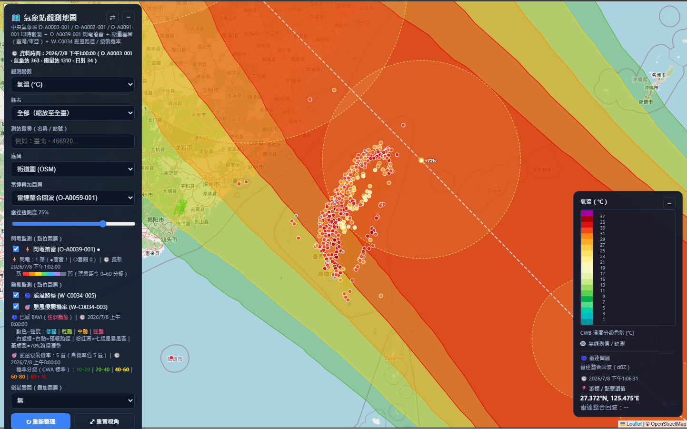

# 直接使用連結 https://chichawang.github.io/CWAdataVIS/

# 氣象署 OPEN DATA 即時觀測資料地圖
以中央氣象署（CWA）開放資料呈現全臺測站即時觀測的互動式地圖。純前端單頁網頁（HTML + [Leaflet](https://leafletjs.com/)），無需後端伺服器。

## 畫面預覽



## 功能特色
- **多種觀測變數**：氣溫、相對濕度、氣壓、風向風速（箭號圖示）、最大陣風、日最高／最低溫、日照時數、日射量，以及當前／1／3／6／12／24 小時累積雨量
- **雷達疊加圖層**（10 分鐘地圖）：雷達整合回波（dBZ）與雷達估計降雨（QPESUMS，mm）可疊加於測站標示下層；透明度調整條位於圖層選單下方、僅在選取圖層時顯示；雷達圖層狀態與游標／點擊讀值（經緯度與回波／雨量數值）整合於右下圖例框
- **格點分析疊加圖層**（逐時地圖）：小時溫度分析與日累積雨量分析格點；透明度調整條位於圖層選單下方、僅在選取圖層時顯示；格點圖層狀態、色階與游標讀值整合於右下圖例框
- **衛星雲圖疊加圖層**（10 分鐘地圖）：高解析可見光、紅外線色調強化、紅外線彩色衛星雲圖，提供**臺灣**（橫麥卡托投影）與**東亞**（蘭伯特正形圓錐投影）兩種範圍，依 CWA 產品文件之投影參數逐像素反投影重採樣為 Web Mercator，海岸線對位準確；透明度調整條僅在選取雲圖時顯示
- **自動更新**：勾選後每 2 分鐘自動重新抓取所有已啟用圖層的資料，狀態列即時顯示下次更新倒數與最近更新時間；更新時不重置視角、不更動觀測變數／縣市／搜尋／圖層等使用者選擇（10 分鐘與逐時地圖皆支援）
- **觀測變數可選「無」**：隱藏所有測站點位與色階，便於單獨檢視雷達、格點、雲圖或颱風圖層
- **閃電落雷即時觀測**：KMZ（壓縮 KML）於瀏覽器端以 JSZip 解壓解析，標記顏色代表落雷距今時間（0–60 分鐘，越紅越新），並區分雲對地（落雷，實心）與雲間閃電（空心）
- **颱風路徑與侵襲機率**：熱帶氣旋過去路徑（依 CWA 強度分級上色：青=熱帶性低氣壓、黃綠=輕颱、橙=中颱、粉紅=強颱）、旋轉颱風符號、七級／十級風暴風半徑圈、白點預報路徑與 70% 路徑潛勢圓；120 小時暴風侵襲機率以 CWA 官方離散分級上色（深綠 10-20%→綠→黃→橙→紅 80%+）
- **海象監測點位**（逐時地圖）：大潮與長浪監測，依警戒狀態上色，測站座標優先取自海象測站基本資料
- **氣象署相似色階**：雨量採 CWA 標準 17 級分級色階、溫度採 CWA 溫度分布圖 2℃ 分級色階，其餘變數為連續漸層色階
- **風場視覺化**：箭號指向風的去向，大小與顏色代表風速
- **縣市篩選與測站搜尋**：可依縣市縮放檢視，或以測站名稱／站號搜尋
- **五種底圖**：街道圖（OSM）、衛星影像、地形圖、深色圖、淺色圖
- **點選測站彈出詳細資訊**：整合氣象、雨量、日射量觀測於同一視窗
- **行動裝置友善**：控制面板、圖例與圖層控制盒皆可縮小／展開，窄螢幕自動縮小並限制面板寬度；控制面板可切換靠左／靠右（⇄ 按鈕）；地圖放大時標示緩慢縮放避免重疊
- **海象自動監控儀表板**：提供資料浮標與潮位站的即時健康監控，具備 KPI 狀態卡（正常、延遲、離線、警報中）與警報日誌，點擊測站可載入並展示 48 小時內各海象觀測指標之歷史時序圖表（Chart.js）
- **地球物理觀測監控儀表板**：提供地球物理觀測資料（地磁、地電、電離層、地下水）之即時健康監控，具備 KPI 狀態卡（正常、延遲、離線、異常值）與警報日誌，點擊測站可載入並展示 48 小時內各變數指標之歷史時序圖表（Chart.js），並內建 JSON 結構診斷工具
- **數值預報模式（NWP）地圖**：全球模式 GFS（M-A0060，0.25°）與區域模式 WRF 15km（M-A0061）／WRF 3km（M-A0064）三合一，於瀏覽器端直接解析 GRIB2（支援 Simple／Complex／Spatial-Differencing 封裝，以及區域模式的 Lambert 正形圓錐網格逐像素重投影）。提供氣溫、海平面氣壓、相對濕度、風速/風向、累積降水，及 850／500／200 hPa 等高空場。特色包括：模式選單一鍵切換、預報時間軸（可播放動畫、點選時間即自動載入、切換時保留所選變數）、風格粒子流場動畫、海岸線／國界疊層強化海陸邊界、高空場自適應色階、常用氣象場建議選單、滑鼠懸停查值與颱風路徑／侵襲機率疊加。GRIB2 檔案較大（約 30–80 MB），首次載入約需 30–90 秒
- **預報整合地圖**（`CWA_forecast_display.html`，設計規劃見 `plan.md`）：以「圖層組合」模型將預報類開放資料整合於單一地圖——陸地底色（368 鄉鎮/22 縣市面量：溫度、體感、降雨機率、濕度、天氣現象、舒適度、UVI、風速，及熱傷害/冷傷害/溫差健康氣象指數）、海面底色（海面分區浪高/風級/天氣，分區為近似示意界線）、航線層（藍色公路 40 航線線色隨時間變化）、點位層（潮汐點漲退潮內插、14 類育樂景點「適遊燈號」規則引擎、海岸瘋狗浪風險、澎湖海水溫預警、海水浴場/休閒漁港/海釣點波流模式預報）、格點層（QPESUMS 未來 1 小時降雨預報）。共用一條 7 天 × 3 小時主時間軸（可播放動畫、各圖層就近對齊並於圖例標註實際有效時刻），點擊任一鄉鎮/海域/航線/點位開啟 Chart.js 時序圖彈窗；「疊加天氣現象圖示」依各縣市日出日沒時刻資料判斷晴天圖示顯示太陽（白天）或月亮（夜間）；右上「圖資與展望」抽屜提供一週天氣預測圖動畫、地面天氣圖、QPF、波浪圖、滿潮/海岸潮線影像圖與月/季長期展望、天氣概況文字；支援 URL hash 分享目前檢視狀態
- **地震即時監測儀表板**（`CWA_opendata_earthquake_display.html`）：整合顯著有感地震報告（E-A0015-001）、小區域有感地震報告（E-A0016-001）與縣市鄉鎮觀測震度（E-A0015-005）三種資料的 3D 震源地圖（deck.gl + MapLibre GL）。震央圓圈、震源深度垂直線與沉於地下的震源球（顏色＝最大震度、大小＝規模、深度可 1–8 倍放大），支援 2D⇄3D 視角切換與五種底圖；地圖下方時間軸可拖曳回放、播放動畫或回到 LIVE 即時模式；右側為 KPI 摘要（顯示中事件、最大規模、24 小時內次數、最新事件）、事件詳情卡（各地區最大震度、測站 PGA/PGV 表、震度圖與報告連結）與最新地震列表（顯著/小區域標籤，點擊飛至震央）；點選顯著地震可疊加該事件之鄉鎮震度分布；每 60 秒自動更新，偵測到新報告即跳出通知、可開啟音效提醒；可篩選報告類型與規模下限
- **金鑰安全**：各頁面進入前皆須輸入 API 授權碼；授權碼僅儲存於使用者瀏覽器（localStorage，可選「記住金鑰」），不會上傳

## 資料來源
| 資料集 | 內容 | 介接方式 |
|---|---|---|
| [O-A0003-001](https://opendata.cwa.gov.tw/dataset/observation/O-A0003-001) | 氣象站 10 分鐘綜觀氣象資料 | REST datastore API |
| [O-A0002-001](https://opendata.cwa.gov.tw/dataset/observation/O-A0002-001) | 雨量站雨量資料 | REST datastore API |
| [O-A0001-001](https://opendata.cwa.gov.tw/dataset/observation/O-A0001-001) | 自動氣象站逐時觀測資料 | REST datastore API |
| [O-A0091-001](https://opendata.cwa.gov.tw/dataset/observation/O-A0091-001) | 署屬氣象站日射量資料（MJ/m²） | 檔案型 fileapi（JSON） |
| [O-A0059-001](https://opendata.cwa.gov.tw/dataset/observation/O-A0059-001) | 雷達整合回波網格（dBZ，921×921） | 檔案型 fileapi（JSON） |
| [O-B0045-001](https://opendata.cwa.gov.tw/dataset/observation/O-B0045-001) | 雷達估計降雨 QPESUMS 網格（mm，441×561） | 檔案型 fileapi（JSON） |
| [O-A0038-003](https://opendata.cwa.gov.tw/dataset/observation/O-A0038-003) | 小時溫度分析格點（0.03°，67×120） | 檔案型 fileapi（JSON） |
| [O-A0040-004](https://opendata.cwa.gov.tw/dataset/observation/O-A0040-004) | 日累積雨量分析格點 | 檔案型 fileapi（JSON） |
| [O-A0039-001](https://opendata.cwa.gov.tw/dataset/observation/O-A0039-001) | 閃電落雷系統即時觀測資料 | 檔案型 fileapi（KMZ，JSZip 解壓） |
| [O-C0042-008](https://opendata.cwa.gov.tw/dataset/observation/O-C0042-008) | 高解析可見光衛星雲圖-臺灣（橫麥卡托投影） | 檔案型 fileapi（JSON → 圖檔） |
| [O-C0042-006](https://opendata.cwa.gov.tw/dataset/observation/O-C0042-006) | 高解析紅外線色調強化衛星雲圖-臺灣 | 檔案型 fileapi（JSON → 圖檔） |
| [O-C0042-002](https://opendata.cwa.gov.tw/dataset/observation/O-C0042-002) | 高解析紅外線彩色衛星雲圖-臺灣 | 檔案型 fileapi（JSON → 圖檔） |
| [O-B0032-001](https://opendata.cwa.gov.tw/dataset/observation/O-B0032-001) | 高解析可見光衛星雲圖-東亞（蘭伯特正形圓錐投影） | 檔案型 fileapi（JSON → 圖檔） |
| [O-B0032-004](https://opendata.cwa.gov.tw/dataset/observation/O-B0032-004) | 高解析紅外線色調強化衛星雲圖-東亞 | 檔案型 fileapi（JSON → 圖檔） |
| [O-B0032-002](https://opendata.cwa.gov.tw/dataset/observation/O-B0032-002) | 高解析紅外線彩色衛星雲圖-東亞 | 檔案型 fileapi（JSON → 圖檔） |
| [W-C0034-005](https://opendata.cwa.gov.tw/dataset/warning/W-C0034-005) | 颱風消息與警報-熱帶氣旋路徑 | REST datastore API |
| [W-C0034-003](https://opendata.cwa.gov.tw/dataset/warning/W-C0034-003) | 颱風消息與警報-颱風侵襲機率 | 檔案型 fileapi（KMZ，JSZip 解壓） |
| [O-B0069-001](https://opendata.cwa.gov.tw/dataset/observation/O-B0069-001) | 大潮監測 | 檔案型 fileapi（JSON） |
| [O-B0070-001](https://opendata.cwa.gov.tw/dataset/observation/O-B0070-001) | 長浪監測 | 檔案型 fileapi（JSON） |
| [O-B0075-001](https://opendata.cwa.gov.tw/dataset/observation/O-B0075-001) | 海象自動監控觀測資料 | REST datastore API |
| [O-B0076-001](https://opendata.cwa.gov.tw/dataset/observation/O-B0076-001) | 海象自動監控測站基本資料 | 檔案型 fileapi（JSON） |
| [O-B0065-001](https://opendata.cwa.gov.tw/dataset/observation/O-B0065-001) | 地球物理連續觀測地下水資料 | 檔案型 fileapi（JSON） |
| [O-B0065-002](https://opendata.cwa.gov.tw/dataset/observation/O-B0065-002) | 地球物理連續觀測地磁資料 | 檔案型 fileapi（JSON） |
| [O-B0065-003](https://opendata.cwa.gov.tw/dataset/observation/O-B0065-003) | 地球物理連續觀測地電資料 | 檔案型 fileapi（JSON） |
| [O-B0065-004](https://opendata.cwa.gov.tw/dataset/observation/O-B0065-004) | 地球物理連續觀測電離層資料 | 檔案型 fileapi（JSON） |
| [O-A0043-001](https://opendata.cwa.gov.tw/dataset/observation/O-A0043-001) | 向日葵九號衛星頻道03反射率（HDF，實驗性，預設隱藏） | 檔案型 fileapi（JSON → HDF，h5wasm 解析） |
| [M-A0060](https://opendata.cwa.gov.tw/dataset/all/M-A0060-000) | 全球預報模式 GFS（0.25° 經緯度網格，預報至 +384h／間隔 6h） | 檔案型 fileapi（JSON → GRIB2，前端解析） |
| [M-A0061](https://opendata.cwa.gov.tw/dataset/all/M-A0061-000) | 區域預報模式 WRF 15km（Lambert 正形圓錐網格，預報至 +84h／間隔 6h） | 檔案型 fileapi（JSON → GRIB2，前端解析） |
| [M-A0064](https://opendata.cwa.gov.tw/dataset/all/M-A0064-000) | 區域預報模式 WRF 3km（Lambert 正形圓錐網格） | 檔案型 fileapi（JSON → GRIB2，前端解析） |
| [A-B0062-001](https://opendata.cwa.gov.tw/dataset/all/A-B0062-001) | 日出日沒時刻－全臺各縣市年度逐日資料（供天氣現象圖示日／夜判斷） | 檔案型 fileapi（JSON） |
| [M-A0085-001](https://opendata.cwa.gov.tw/dataset/all/M-A0085-001) | 熱傷害指數及警示－全臺各鄉鎮五日逐三小時預報（預報整合地圖） | 檔案型 fileapi（JSON） |
| [M-B0078-001](https://opendata.cwa.gov.tw/dataset/all/M-B0078-001) | 海水浴場、休閒漁港、海釣之波流模式預報資料（預報整合地圖） | 檔案型 fileapi（JSON） |
| [E-A0015-001](https://opendata.cwa.gov.tw/dataset/earthquake/E-A0015-001) | 顯著有感地震報告（震央、規模、深度、各地測站震度與 PGA/PGV） | REST datastore API |
| [E-A0015-005](https://opendata.cwa.gov.tw/dataset/earthquake/E-A0015-005) | 顯著有感地震報告－縣市行政區（鄉鎮）觀測震度資料 | 檔案型 fileapi（JSON） |
| [E-A0016-001](https://opendata.cwa.gov.tw/dataset/earthquake/E-A0016-001) | 小區域有感地震報告（不編號地震） | REST datastore API |

資料皆來自[中央氣象署氣象資料開放平臺](https://opendata.cwa.gov.tw/)。颱風路徑與侵襲機率產品僅於西北太平洋及南海有熱帶氣旋活動／警報期間提供資料；閃電落雷與可見光雲圖於無閃電／夜間時內容可能為空，均屬正常。衛星雲圖與衛星觀測資料之時間欄位為 UTC，頁面顯示時已轉換為台灣時間。衛星雲圖投影參數（臺灣：橫麥卡托，中央經緯度 121.0E/23.7N；東亞：蘭伯特正形圓錐，中央經緯度 128.5E/0.0N、參考緯度 30N/60N）依 [CWA 衛星雲圖產品說明文件](https://www.cwa.gov.tw/Data/data_catalog/3-7-1.pdf)。數值預報模式（M-A0060／M-A0061／M-A0064）為 GRIB2 格式並於瀏覽器端解析；區域模式 WRF（M-A0061／M-A0064）採 Lambert 正形圓錐投影網格，載入後依 [CWA WRF 產品說明文件](https://opendata.cwa.gov.tw/opendatadoc/MIC/A0061.pdf)之投影參數重投影疊至地圖，模式資料為 UTC 時間、頁面顯示已轉為台灣時間。

## 使用方式
1. 至[氣象署開放資料平臺](https://opendata.cwa.gov.tw/user/authkey)免費註冊會員並取得 API 授權碼（格式 `CWA-XXXXXXXX-...`）
2. 開啟網頁 https://chichawang.github.io/CWAdataVIS/ ，選擇「逐 10 分鐘觀測」、「逐時觀測 × 格點分析」、「即時海象監控」、「地球物理觀測」、「地震即時監測」、「預報整合」或「數值預報模式（GFS／WRF）」地圖/儀表板，輸入授權碼即可進入（各頁面進入前皆須先輸入金鑰。數值預報模式因 GRIB2 檔案較大，載入需較久時間）
3. 勾選「記住金鑰」可儲存於瀏覽器，下次直接載入

## 檔案結構
```
├── index.html                        # 首頁（入口連結，可選擇各觀測地圖/儀表板）
├── CWA_opendata_10min_display.html   # 逐 10 分鐘觀測地圖（單一檔案，含 HTML/CSS/JS）
├── CWA_opendata_hourly_display.html  # 逐時觀測 × 格點分析地圖（單一檔案，含 HTML/CSS/JS）
├── CWA_opendata_marine_display.html  # 海象自動監控儀表板（單一檔案，含 HTML/CSS/JS）
├── CWA_opendata_geophysical_display.html # 地球物理觀測監控儀表板（單一檔案，含 HTML/CSS/JS）
├── CWA_opendata_NWPmodel_display.html # 數值預報模式地圖：GFS 全球 + WRF 區域 15km/3km（GRIB2 前端解析，單一檔案）
├── CWA_forecast_display.html         # 預報整合地圖：鄉鎮/海面/藍色公路/潮汐/育樂/QPF/健康氣象/波流模式（單一檔案，規劃見 plan.md）
├── CWA_opendata_earthquake_display.html # 地震即時監測儀表板：3D 震源地圖 × 時間軸 × 最新地震列表（單一檔案，deck.gl）
├── plan.md                           # 預報整合地圖之資料盤點與設計規劃文件
├── examples/
│   └── 10min.png                     # 逐 10 分鐘觀測地圖畫面截圖
└── README.md
```

## 缺測值處理
依 CWA 資料標準，`X`（儀器故障）、`-99`（缺值或資料異常）、`None` 等特殊代碼一律視為缺測，於地圖上以灰點呈現。

## 版權與授權宣告
- **版權所有**：Copyright (c) [2024-2026] 王志嘉. All rights reserved.
- **開源授權**：本專案之開源版本核心代碼採用 **GNU Affero General Public License v3.0 (AGPL-3.0)** 條款授權。
- **商業授權**：本專案保留未來提供雙重授權（Dual-licensing）與企業版（Enterprise Edition）之權利。若有閉源整合或 SaaS 商業使用且無法遵守 AGPL-3.0 開源規範之需求，請於github上洽談商業授權。

## 數據與第三方資源致謝
- **氣象資料**：中央氣象署氣象資料開放平臺（遵循 [政府資料開放授權條款-第1版](https://data.gov.tw/license)）
- **颱風圖例與配色**：參考中央氣象署 [颱風機率預報產品說明](https://www.cwa.gov.tw/V8/C/P/Typhoon/TY_NEWS.html) 與 [颱風消息地圖](https://app.cwa.gov.tw/web/obsmap/typhoon.html)
- **地圖圖磚**：© OpenStreetMap contributors、Esri World Imagery、OpenTopoMap、CARTO
- **海岸線／國界向量**：[Natural Earth](https://www.naturalearthdata.com/)（Public Domain 公共領域）

## 第三方開源元件元件宣告
本專案使用了以下開源元件，其版權與授權歸原作者所有：
- **Leaflet 1.9.4** (BSD 2-Clause License)
- **JSZip 3.10.1** (MIT License / GPLv3)
- **Chart.js** (MIT License)
- **deck.gl 8.9** (MIT License)（地震即時監測儀表板 3D 圖層）
- **MapLibre GL JS 3.6** (BSD 3-Clause License)（地震即時監測儀表板底圖）
